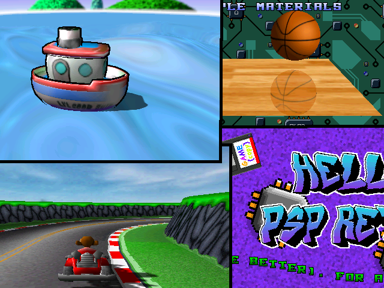
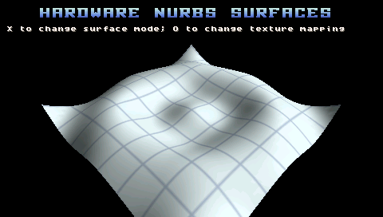
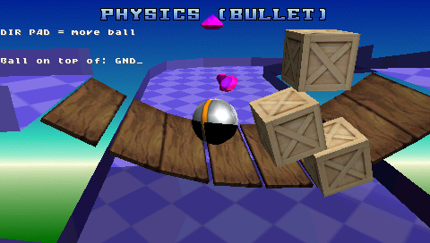
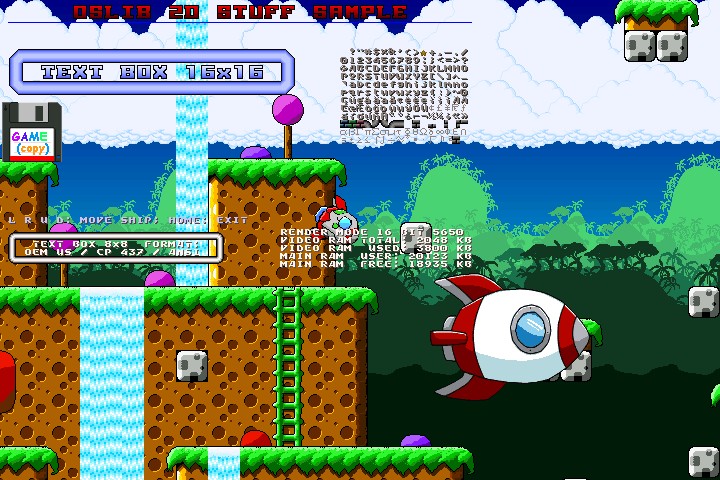
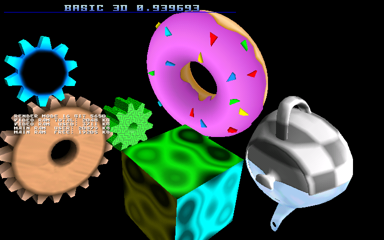

# M3DLIB for PSP 
  

  
This is a "GAME ENGINE" for the PlayStation Portable, it is a wrapper around several libraries,
which are combined in one, the relevant functions are exposed as "M3D" by including M3D.h.  
Thanks to the creators of AMGLib (Andresmargar), OSLib, and bullet.  
  
I just wanted to create an engine easy to use, and powerful enough to create things you can call "games" for PSP.  
  
**<ins>OSLIB:</ins>** Unchanged as it was in late 2024, I include a copy here, in M3D_LIBS folder.  
If you want to access all OSL functions, just "#include <oslib/oslib.h>".  
This M3D warpper does not implemet any wifi/net/load/save functions, you can use OSL ones.  
  
**<ins>BULLET:</ins>** Version 2.82-r2704, I also include it in M3D_LIBS folder.  
  
**<ins>AMGLib:</ins>** This is a heavily modified version of the original, I added a lot of functions here.  
Thanks again to Andresmargar for creating this.  

**<ins>OPENTRI:</ins>** I just used the particle system from this lib, because I could not make it work from the library included in pspsdk.

## FUNCTIONS  

I don't want to create a complex doc because functions are not complex at all, that was the point of doing this.  
So this is a brief description of everything M3D does. For more details, **read the samples and M3D_LIBS/AMGLib/M3D.h file** (Incomplete, I'm adding add comments for all functions needed).

**<ins>LOADING FUNCTIONS:</ins>** for images/fonts, maps, music, models.  
**<ins>VFPU MATH FUNCTIONS:</ins>** like sin, cos etc.  
**<ins>2D FUNCTIONS:</ins>** Print, draw (lines, rectangles, sprites, maps, and some retro effects like plasma and copper bars).  
**<ins>2D ANIMATIONS:</ins>** Sprite animations, sprite rotation, palette animation, map animation (replace/animate tiles).  
**<ins>MULTIMEDIA:</ins>** Play music and videos.  
**<ins>3D SCENES:</ins>** Cameras, lights, model rendering, multitextures, environment mapping textures, render to texture.   
**<ins>3D ANIMATION:</ins>** Skinned and morphing models.  
**<ins>3D SHADOWS:</ins>** Volumetric stencil shadows, and projection shadows.  
**<ins>STENCIL MIRRORS:</ins>** A simple mirror/glossy surface simulation.  
**<ins>3D PARTICLES:</ins>** A simplified version of OPENTRI library particle system, with several parameters to set.  
**<ins>3D BULLET PHYSICS:</ins>** Several shapes (sphere, cone, box, triangle mesh), gravity, set forces, collision detection, ray tracing collision, constraints (ball and hinge), simple vehicle (Car).  
**<ins>FAKE BUMP MAPPING:</ins>** A simulation of modern shaders using paletted textures, only works well on mostly flat surfaces.  
**<ins>3D NURBS:</ins>** PSP can generate a surface from several points you can animate, I added this because I think it looks ok for simple water simulations.   
**<ins>TV OUT:</ins>** You can enable TV OUT mode (on PSP 2000+), it will output a 720x480 image. This will be slow unless you use 4444, 5551 or 5650 modes.
You need the file "dvemgr.prx" in the same folder as the EBOOT.PBP to enable TV-OUT. I could recompile dvemgr.prx from the source (in M3D_LIBS) But it does not wrok well, so use the one found inside many samples (there is also a copy in M3D_LIBS called "dvemgr_WORKS.prx").  

## SOME TESTS
  
MULTITEXTURE SAMPLE:  
 
  
NURBS SURFACE:  

  
PHYSICS TEST:  

SKINNED MODEL:  
  

RENDER TO TEXTURE (CRT models from N64's tiny3D engine):  
  

TV-OUT OSLIB MAPS + SPRITES (captured on PPSSPP debugger, which sometimes shows correctly the 768x480 TV-OUT framebuffer):  

TV OUT IN 3D MODE:  
  

## INSTALL & TEST
  
Copy libM3D.a to pspsdk libs folder, and M3D.h to include folder.
In windows you can use "install.bat" inside M3D_LIBS folder (edit the file and configure
your PSPSDKDIR first).  
   
To compile the samples or create your programs, run make inside any sample folder, 
or run compile_WSL.bat in windows. You need the last pspsdk (2025) which was only releassed 
for linux. If you use windows most computers can run WSL1 from windows (WSL 1 is fast). 
If your PC is very old and can't run WSL, just install linux, or use a virtual machine with 
any linux distrubution. If you use mac, I can't help you.  

For more advance modifications, just modify and compile AMG, OSL and BULLET.  
  
AMG code is a bit messy, but it is not very complex, I hope someone can find it useful, at least to learn how to use the skinned / morphing models.  
  
   
## CREATE ASSETS

**<ins>IMAGES:</ins>** just PNG files, 32 bit RGBA, 24 bit RGB, indexed 256/16 colors.  
**<ins>FONTS:</ins>** just PNG files, 32 bit RGBA, 24 bit RGB, indexed 256/16 colors. Image must be 16x16 characters, arranged as defined in basic ascii.
It will support latin characters, or any other character supported when saving source files as "OEM US FORMAT / OEM US / CP 437 / ANSI".  
**<ins>SPRITES:</ins>** just PNG files, 32 bit RGBA, 24 bit RGB, indexed 256/16 colors. Create them by placing every animation frame from left to right, and from top to bottom.   
**<ins>2D MAPS:</ins>** create them using a PNG image for the tiles, and TILED to create the map http://www.mapeditor.org/
maps must be in CSV format.  
**<ins>MUSIC & SOUND:</ins>** OSL handles this, it can load wav, MP3, BGM, and tracker formats (MOD,XM,IT).Be careful when loading tracker modules, they can use a lot of CPU/RAM.  
**<ins>VIDEOS:</ins>** Supports MJPEG and H264 videos (script to convert them in UTILS folder) up to 480x272 60 FPS. Some 60 FPS videos will crash.  
**<ins>3D IMAGE MIPMAPS:</ins>** If you enable mipmapping, you can use custom mipmaps by giving your main texture the name "image.png", the first mipmap "image_mip1.png" and the second mipmap "image_mip2.png". These three images must use the same color format, else PSP will crash.  
**<ins>3D MODELS:</ins>** I use Blender 2.79 for 3D model creation, because 2.8+ works very slow on my PC. Blender 2.7 will run very well on any PC.  
Supported models are:
  - ply: The fist version, as it is exported by Blender 2.7.
  - obj/mtl: Should have no problems with these.
  - m3b: Binary PSP models, in PSP's internal format. (Blender 2.7 export plugin included).  
There is a python script to create fur/grass textures inside utils folder, once you crate the texture, you have to make objects with several layers, each one using part of the texture.

**<ins>3D SKINNED MODELS:</ins>** These models use BONES to show animations, skinned models are incredibly complex, so I created a very simple format
(Blender 2.7 export plugin included) which is processed by the PSP when loading.  
It is probably very easy to port the plugins to newer versions of Blender, but I just didn't have the motivation to port them.  
Supported models are:
  - m3a: custom format (Blender 2.7 export plugin included).

There are limitations when using these models:
  - Every vertex can have **only one bone** assigned.  
  - A triangle can only contain vertices fron **2 bones max**.
  - Create the armature by cloning bones (not extruding!!) and placing them at the rotation points of your model.  
  - Do not forget to parent the bones before asigning the armature to the object, if not, bone will rotate around 0,0,0.  
  - While **in EDIT MODE, do NOT rotate the bones** in the X or Y axis, just place them around and parent the bones as you like.
  - Only the first bone can be translated, it will translate the whole model. The rest of the bones **only support rotation**, (not translation or scale).
  - Do not forget to apply location, rotation and scale to the armature object and the models.  
  - Do not rotate or translate bone.0 at frame 0, PSP will use this as the default position.  
    
**<ins>3D MORPHING MODELS:</ins>** These models are created by storing several shapes, then the PSP can render a transition from one to the other.
Supported models are:
  - m3m: a bunch of binary PSP models (Blender 2.7 export plugin included).
Only 8 frames are supported.

For more details, I included Blender 2.7 files with most of the models, so people can see how textures, triangles and bones are arranged.  
All models are exported with PSP internal coordinate system (in Blender 2.7: -Z FORWARD; Y UP):
  - Z: -Z = FORWARD; +Z = BACKWARD   
  - Y: -Y = DOWN; +Y = UP  
  - X: -X = LEFT; +X = RIGHT

## BUGS
  - Sometimes you can load images with the wrong format and it will crash the image loader (OSLIB)
  - Be sure there are no custom mipmap images (image_mip1 or image_mip2) if you are not going to use them, again the texture loader can automatically load them with the wrong format, and crash the system.
  - Doing things like "M3D_Model *Models[32];" can cause memory leaks if the array is too big.  
  
  
   
## OPTIMIZE
  
1- Do not use lighting unless you really need it.  
2- Use small (< 128x128) and indexed textures (16/256 colours).  
3- Use models as low poly as you can.  
4- Avoid using nested "for" loops bigger than 128x128.  
5- Use color mode 5650 (or 5551 if you want the shadows to work) with dither enabled, it is much faster that 8888 mode and it will look good.  
